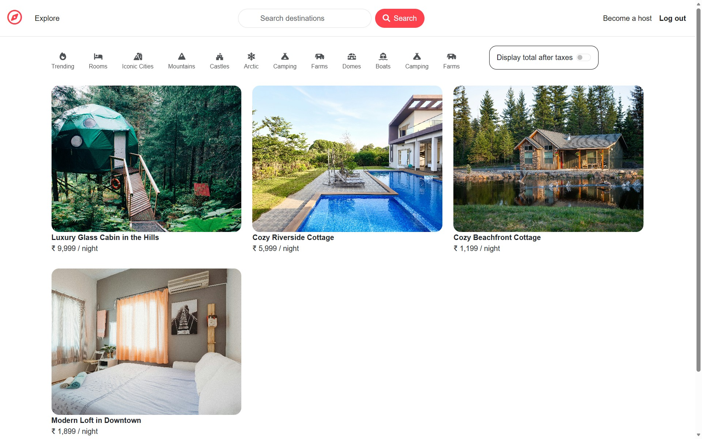
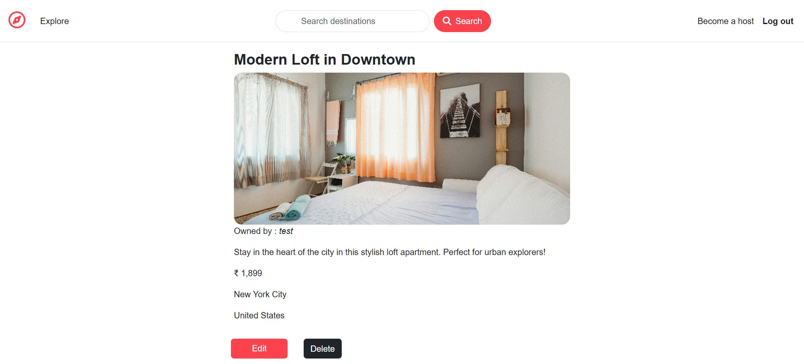
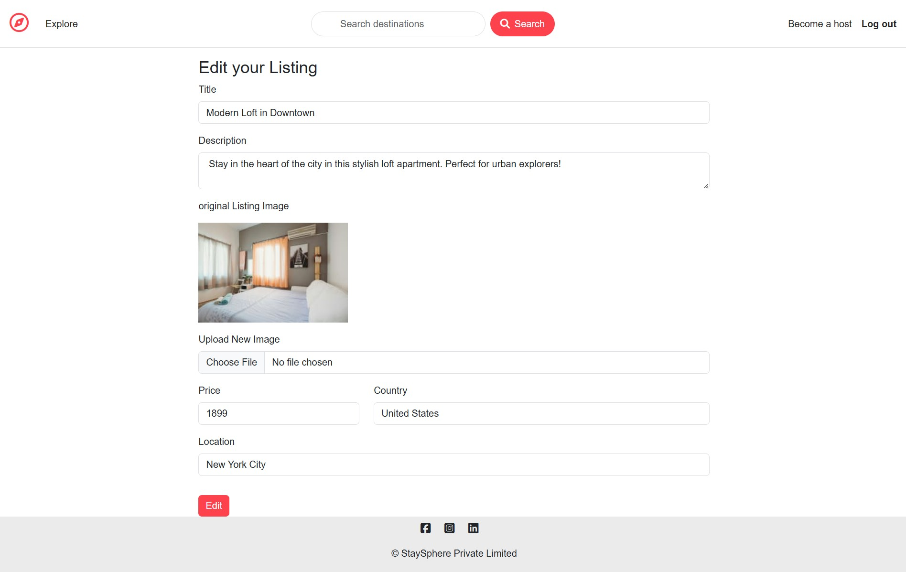
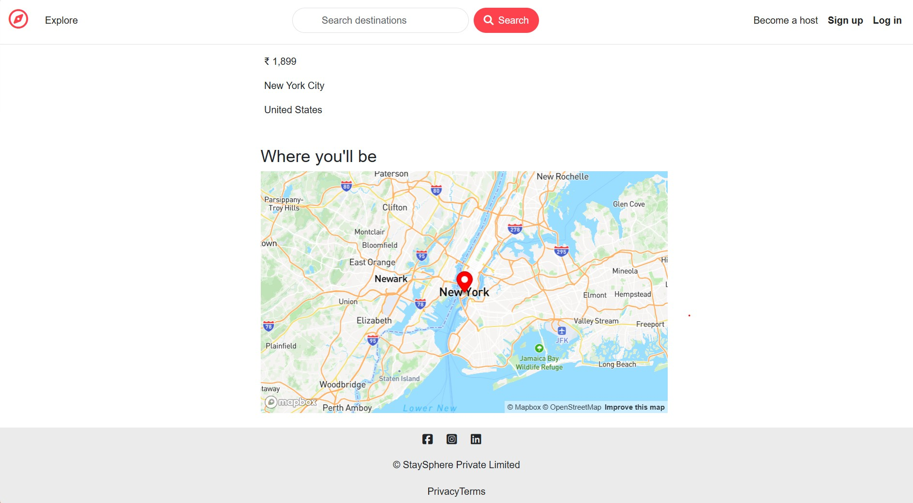
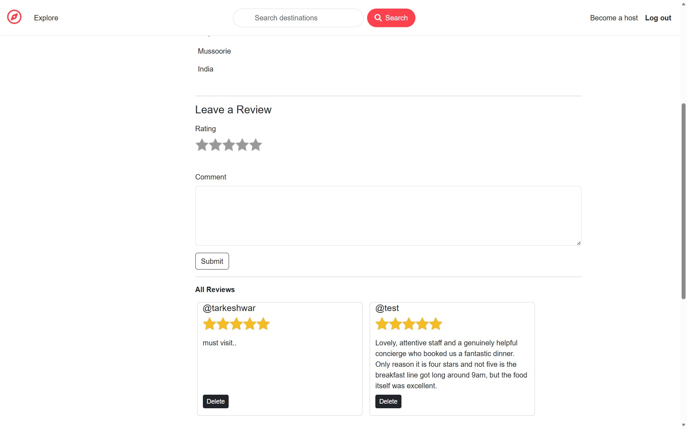
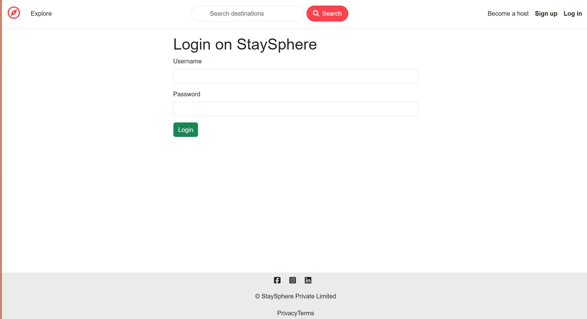
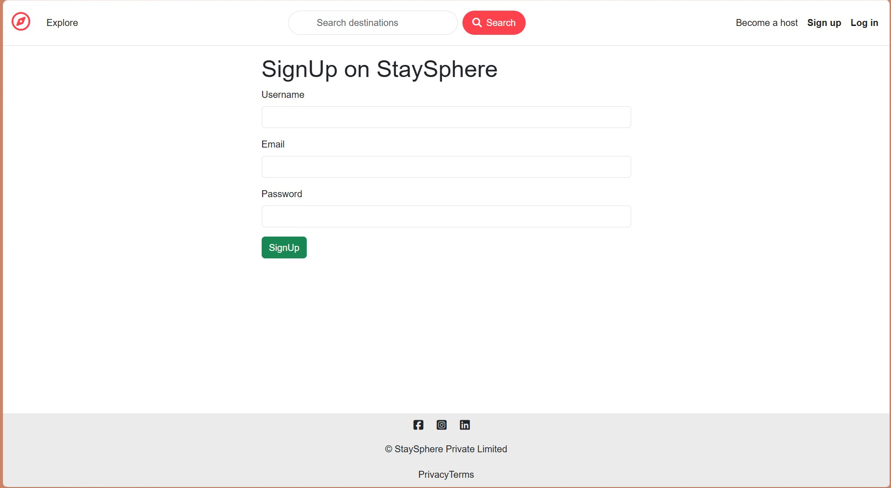

<div align="center">



# 🏡 StaySphere

### Discover • Explore • Stay

A **full-stack vacation rental platform** inspired by Airbnb — explore unique stays, publish and manage your own listings, upload property photos, pin locations on an interactive map, and share travel experiences through reviews.

<br>

[](https://staysphere-ex1q.onrender.com)
[](https://github.com/CodeCrafter-hue/StaySphere-mern)
[](#-license)

<br>


[Live Demo](#-live-demo) • [Features](#-key-features) • [Tech Stack](#-technology-stack) • [Screenshots](#-screenshots) • [Getting Started](#-getting-started) • [Architecture](#-mvc-architecture)

</div>

---

## 📑 Table of Contents

- [Project Overview](#project-overview)
- [Live Demo](#-live-demo)
- [Key Features](#-key-features)
- [Screenshots](#-screenshots)
- [Technology Stack](#-technology-stack)
- [Project Structure](#-project-structure)
- [MVC Architecture](#-mvc-architecture)
- [Authentication Flow](#-authentication-flow)
- [Authorization Flow](#-authorization-flow)
- [Cloudinary Workflow](#cloudinary-workflow-section)
- [Mapbox Workflow](#mapbox-workflow-section)
- [Database Collections](#-database-collections)
- [Getting Started](#-getting-started)
- [Environment Variables](#-environment-variables)
- [Deployment](#-deployment)
- [Security Features](#-security-features)
- [Challenges Faced](#-challenges-faced)
- [What I Learned](#-what-i-learned)
- [Future Improvements](#-future-improvements)
- [Contributing](#-contributing)
- [Author](#-author)
- [License](#-license)

---

## Project Overview

StaySphere is a full-stack vacation rental platform that lets travelers discover and explore accommodations, while enabling hosts to publish and manage their own listings.

The application follows the **MVC (Model–View–Controller)** architecture and implements secure authentication, ownership-based authorization, cloud image uploads, interactive maps, session management, server-side validation, and a complete CRUD workflow — showing how modern web apps combine frontend templating, backend services, cloud storage, third-party APIs, and a database into one scalable platform.

---

## 🔗 Live Demo

| | |
|---|---|
| 🌐 **Application** | [staysphere-ex1q.onrender.com](https://staysphere-ex1q.onrender.com) |
| 💻 **Repository** | [github.com/CodeCrafter-hue/StaySphere-mern](https://github.com/CodeCrafter-hue/StaySphere-mern) |

> ⚠️ Hosted on Render's free tier — the server spins down after inactivity, so the first request may take **30–60 seconds** to wake up.

---

## ✨ Key Features

### 🔐 Authentication
- Secure user registration & login with hashed passwords
- Session-based authentication (persists across restarts via MongoDB session store)
- Logout & protected-route access control

### 🛡️ Authorization
- Only a listing's owner can **edit** or **delete** it
- Only a review's author can **delete** their own review
- Auth required before creating/editing/deleting listings or adding/deleting reviews

### 🏠 Listing Management
- Full CRUD — browse, view, create, edit, and delete listings
- Upload and replace listing images

### 🖼️ Image Uploads
- Images uploaded via **Multer** and stored on **Cloudinary**
- Automatic cloud optimization & a default fallback image

### 🗺️ Interactive Maps
- Automatic geocoding of the listing's location (Mapbox Geocoding API)
- Interactive marker map on each listing page (Mapbox GL JS)

### ⭐ Reviews & Ratings
- Star ratings + written comments
- Review ownership & secure deletion

---

## 📸 Screenshots

<table>
<tr>
<td width="50%">

**Home — Browse Listings**


</td>
<td width="50%">

**Listing Detail**


</td>
</tr>
<tr>
<td width="50%">

**Create a New Listing**


</td>
<td width="50%">

**Edit a Listing**


</td>
</tr>
<tr>
<td width="50%">

**Interactive Map**


</td>
<td width="50%">

**Reviews & Ratings**


</td>
</tr>
<tr>
<td width="50%">

**Login**


</td>
<td width="50%">

**Sign Up**


</td>
</tr>
</table>

> 📁 Place these 8 images in a `ScreenShots/` folder at the project root (matching the filenames above) so they render on GitHub.

---

## 💻 Technology Stack

### Frontend
| Technology | Purpose |
|---|---|
| HTML5 / CSS3 | Structure & styling |
| Bootstrap 5 | Responsive UI |
| JavaScript (ES6) | Client-side interactivity |
| EJS + EJS-Mate | Server-side templating & layouts |

### Backend
| Technology | Purpose |
|---|---|
| Node.js | JavaScript runtime |
| Express 5 | Web framework & routing |
| method-override | Enables PUT/DELETE from HTML forms |

### Database
| Technology | Purpose |
|---|---|
| MongoDB Atlas | Cloud-hosted database |
| Mongoose | ODM / schema modeling |

### Authentication & Security
| Package | Purpose |
|---|---|
| Passport.js + passport-local | Username/password auth strategy |
| passport-local-mongoose | Password hashing & user model plugin |
| express-session + connect-mongo | Session management, stored in MongoDB |
| connect-flash | One-time flash notifications |

### Validation
| Package | Purpose |
|---|---|
| Joi | Server-side request validation |
| Mongoose schema validation | Database-level validation |

### Cloud Services
| Service | Purpose |
|---|---|
| Cloudinary + multer + multer-storage-cloudinary | Image upload & hosting |
| Mapbox SDK (Geocoding + GL JS) | Location lookup & interactive maps |

### Deployment
| Platform | Purpose |
|---|---|
| Render | Application hosting |
| MongoDB Atlas | Database hosting |
| Cloudinary | Media hosting |

<details>
<summary>📦 Full dependency list (from <code>package.json</code>)</summary>

```
express               ^5.2.1
mongoose              ^9.7.2
ejs                   ^6.0.1
ejs-mate              ^4.0.0
passport              ^0.7.0
passport-local        ^1.0.0
passport-local-mongoose  ^9.1.0
express-session       ^1.19.0
connect-mongo         ^6.0.0
connect-flash         ^0.1.1
method-override       ^3.0.0
dotenv                ^17.4.2
joi                   ^18.2.3
multer                ^2.2.0
multer-storage-cloudinary  ^4.0.0
cloudinary            ^1.41.3
@mapbox/mapbox-sdk    ^0.16.2
cookie-parser         ^1.4.7
```

</details>

---

## 📂 Project Structure

```
StaySphere-mern/
├── controllers/         # Route handler logic (listings, reviews, users)
│   ├── listings.js
│   ├── reviews.js
│   └── users.js
├── init/                 # Database seed / initialization scripts
│   ├── data.js
│   └── index.js
├── models/               # Mongoose schemas
│   ├── listing.js
│   ├── review.js
│   └── user.js
├── public/               # Static assets
│   ├── css/
│   ├── js/
│   └── uploads/
├── routes/               # Express route definitions
│   ├── listing.js
│   ├── review.js
│   └── user.js
├── utils/                # Helpers
│   ├── ExpressError.js
│   └── wrapAsync.js
├── views/                # EJS templates
│   ├── includes/
│   ├── layouts/
│   ├── listings/
│   ├── users/
│   └── error.ejs
├── ScreenShots/          # README screenshots
├── app.js                # Application entry point
├── cloudConfig.js         # Cloudinary configuration
├── middleware.js          # Auth / ownership / validation middleware
├── package.json
└── README.md
```

---

## 🏗 MVC Architecture

```
        User
         │
         ▼
   Express Routes
         │
         ▼
  Controller Layer
         │
   ┌─────┴─────┐
   ▼           ▼
 Models    Views (EJS)
   │           ▲
   └─────┬─────┘
         ▼
   MongoDB Atlas
```

**Benefits:** clear separation of concerns, easier maintenance, reusable logic, and a structure that scales as the app grows.

---

## 🔐 Authentication Flow

```
User → Signup / Login → Passport.js → Session Created
     → Stored in MongoDB Session Store → Authenticated User
     → Access to Protected Routes
```

- Passwords are hashed (never stored in plaintext)
- Sessions persist across server restarts
- User serialization/deserialization handled by Passport

## 🧾 Authorization Flow

```
User requests Edit/Delete
          │
   Is user the owner?
     ┌────┴────┐
    Yes        No
     │          │
  Continue   403 / Access Denied
```

The same ownership check applies to review deletion.

---

<a id="cloudinary-workflow-section"></a>
## ☁️ Cloudinary Workflow

```
Choose Image → Multer Upload → Cloudinary Storage
   → Cloudinary URL Generated → Saved in MongoDB → Rendered in Views
```

<a id="mapbox-workflow-section"></a>
## 🗺️ Mapbox Workflow

```
User enters Location → Mapbox Geocoding API → Lat/Lng Coordinates
   → Stored in MongoDB → Mapbox GL JS → Interactive Map Rendered
```

---

## 📊 Database Collections

| Collection | Stores |
|---|---|
| **Users** | Username, email, hashed password |
| **Listings** | Title, description, price, country, location, image, geometry, owner ref, review refs |
| **Reviews** | Rating, comment, author ref |

---

## 🚀 Getting Started

### Prerequisites

- **Node.js** — this project specifies `24.14.1` in `package.json` `engines`; Node 20+ should also work fine
- **npm**
- **Git**
- A **MongoDB Atlas** account (or local MongoDB instance)
- A **Cloudinary** account
- A **Mapbox** account with an access token

### Installation

```bash
# Clone the repository
git clone https://github.com/CodeCrafter-hue/StaySphere-mern.git
cd StaySphere-mern

# Install dependencies
npm install
```

### 🔑 Environment Variables

Create a `.env` file in the project root:

```env
ATLASDB_URL=your_mongodb_connection_string
SECRET=your_session_secret
MAP_TOKEN=your_mapbox_public_token
CLOUD_NAME=your_cloudinary_cloud_name
CLOUD_API_KEY=your_cloudinary_api_key
CLOUD_API_SECRET=your_cloudinary_api_secret
```

> ⚠️ Double-check these match the exact `process.env.*` keys read in `app.js` / `cloudConfig.js`.

### Seed the database *(optional)*

```bash
node init/index.js
```

### Run the app

```bash
# Development (auto-restart on changes)
npx nodemon app.js

# or plain Node
node app.js
```

Then open:

```
http://localhost:3030/listings
```

*(adjust the port to whatever is configured in `app.js`)*

---

## 🌍 Deployment

| Layer | Service |
|---|---|
| Web App | [Render](https://render.com) |
| Database | MongoDB Atlas |
| Images | Cloudinary |
| Maps | Mapbox |

**Live:** https://staysphere-ex1q.onrender.com

---

## ⚙️ Middleware

| Middleware | Responsibility |
|---|---|
| Authentication | Verifies the user is logged in before protected actions |
| Authorization | Confirms listing/review ownership before edit/delete |
| Validation | Joi schema validation for listings & reviews |
| Error Handling | Global error handler + async wrapper for clean try/catch-free controllers |

---

## 🛡 Security Features

✔ Password hashing via `passport-local-mongoose`
✔ Session-based authentication with MongoDB-backed session store
✔ Route-level protection & ownership checks
✔ Server-side form validation (Joi)
✔ Secure, cloud-based image uploads
✔ Flash messages for user feedback
✔ Centralized error handling

---

## 💡 Challenges Faced

- **Auth & sessions** — getting registration, login, and persistent sessions working reliably
- **Authorization** — restricting edit/delete strictly to resource owners
- **Image uploads** — wiring Multer → Cloudinary, and replacing images on edit without losing existing data
- **Maps** — converting free-text locations into coordinates and rendering markers accurately
- **Deployment** — managing environment variables, Atlas connectivity, and Cloudinary config in production

## 📚 What I Learned

Full-stack architecture (MVC) • REST APIs • MongoDB relationships • Express middleware design • Passport authentication • Session management • Cloudinary & Mapbox integration • Deployment • Git/GitHub workflows • Centralized error handling

---

<!-- ## 🗺️ Roadmap -->
## 🚀 Future Improvements

- [ ] Property wishlist
- [ ] Online booking system with date ranges
- [ ] Payment gateway integration
- [ ] User profiles & booking history
- [ ] Email verification & password reset
- [ ] Advanced search & filters
- [ ] AI-powered property recommendations
- [ ] Image gallery per listing
- [ ] Host ⇄ guest chat
- [ ] Admin dashboard & analytics
- [ ] Multi-language support & dark mode

---

## 🤝 Contributing

Contributions are welcome!

1. Fork the repository
2. Create a feature branch: `git checkout -b feature/amazing-feature`
3. Commit your changes: `git commit -m "Add amazing feature"`
4. Push to your branch: `git push origin feature/amazing-feature`
5. Open a Pull Request

---

## 👨‍💻 Author

**Tarkeshwar Kumar Yadav**
MCA Student · Full Stack MERN Developer

[](https://github.com/CodeCrafter-hue)
[](https://www.linkedin.com/in/tarkeshwar-kumar-y-86584622a)

---

## 📄 License

Licensed under the **ISC License** (as declared in `package.json`). Built as a learning project and personal portfolio piece — feel free to fork and build on it.

---

<div align="center">

### ⭐ If you found this project useful, consider giving it a star on GitHub!

</div>
